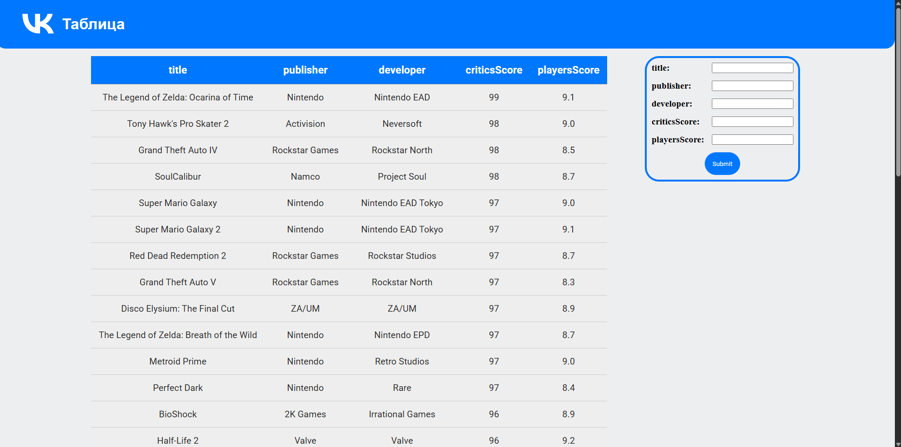

# VK Таблица

---



## О проекте

Это небольшой проект для отборочных на стажировку в VK. В нём выводится таблица с данными и форма, которая позволяет отправлять на сервер новые данные и отображает их при успешной отправке. Реализована **пагинация** в виде бесконечного скролла.

## Запуск

```javascript
npm install;
npm run db;
npm run dev;
```
  
## Стек

* **TypeScript**
* **React**
* **Vite**
* **MobX**


### Обоснование использование стейт-менеджера

Решение использовать MobX обусловлено двумя соображениями:
1. Стейт-менеджер позволяет удобно использовать данные, которые могут пригодиться в разных компонентах, избегая prop drilling'a. Конкретно на проекте это очень упростило перенос заглавий из таблицы в форму, но также это поможет в дальнейшем при расширении функционала проекта. (допустим, добавления фильтрованных таблиц и т.д.)
2. Конкретно **MobX** я использовал потому что он есть в стеке VK и я хотел лишний раз с ним поработать (понравилось)